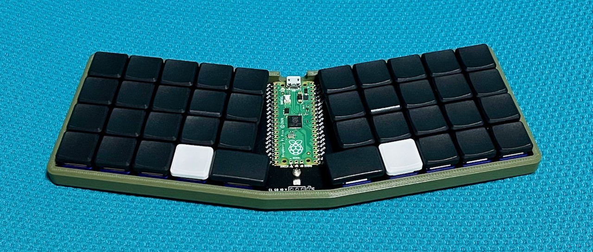

# Vpico

Vpico is a 40-key ortholinear keyboard powered by Raspberry Pi Pico, PicoRuby and PRK-Firmware.

#  BOM

|Name | Part number|Quantity|
|------|-----|-----|
| MCU | Raspberry Pi Pico | 1|
| PCB | Vpico PCB | 1|
| Case | Vpico.step | 1|
| MX-compaible key switch or Kailh Choc key switch | 5pins | 40|
| Diode | 1N4148 TH or SMD  | 40|
| Screw | M2 L4mm | 5|
| Keycap 18x17 | 1U | 38|
| Keycap 27x17 | 1.5U | 2|
| LED | SK6812MINI-E | 1|
| Adhesive rubber feet | Dia.9mm or smaller | 4|
